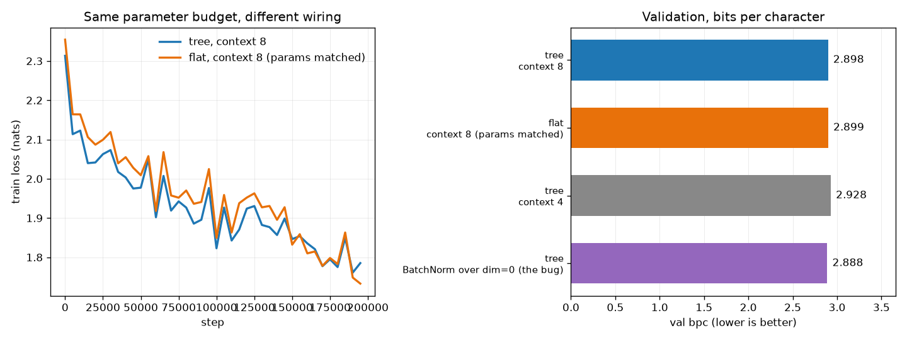
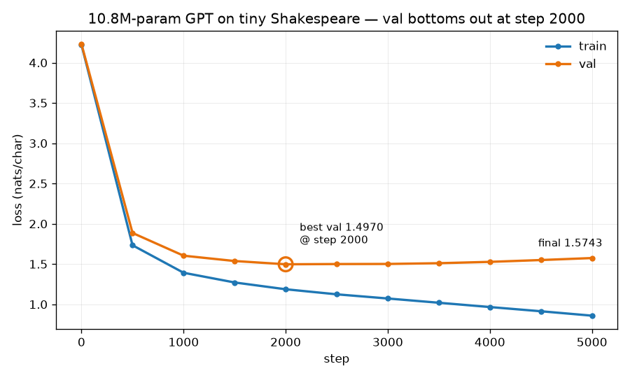
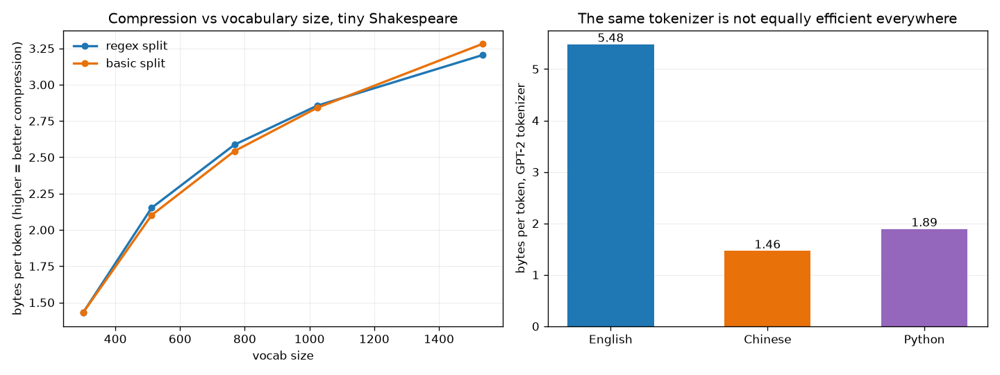
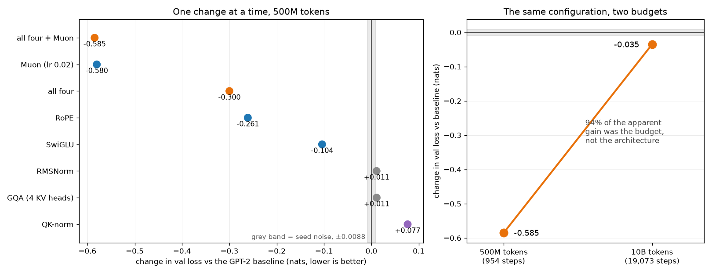

# GPT from Scratch

Working through Karpathy's *Neural Networks: Zero to Hero*, one directory per
lecture, with a shared dataset and a shared train/val/test split so the loss
numbers stay comparable across chapters.

## Results

| chapter | model | params | val | baseline |
|---|---|---|---|---|
| 02 | bigram (counting) | 729 | 3.5555 bpc | 4.7549 uniform |
| 03 | MLP, 6-char context | 17,897 | **2.9769 bpc** | 3.5555 bigram |
| 04 | 6 layers + BatchNorm | 47,024 | 3.0521 bpc | 3.0648 the 03 MLP |
| 05 | same net, every gradient hand-written | 12,297 | 3.0629 bpc | 3.0648 with autograd |
| 06 | WaveNet-style tree, 8-char context | 76,579 | **2.8977 bpc** | 2.9769 the 03 MLP |
| 07 | 6-layer Transformer, tiny Shakespeare | 10.8M | 2.1597 bpc (best) | own corpus, 6.022 uniform |
| 08 | BPE tokenizer from scratch | — | 3.21 bytes/token @ vocab 1536 | 1.0, raw bytes |
| 09 | GPT-2 124M reproduction, 10B tokens on 2x RTX 4090 | 124M | **3.0778 nats/token**, HellaSwag **0.3012** | 3.2799 / 0.2976 — OpenAI's checkpoint, measured here |
| 09 | + RoPE, SwiGLU, RMSNorm, GQA, Muon | 114M | **3.0429**, HellaSwag **0.3140** | 3.0778 / 0.3012 — the baseline above |

Chapters 02–05 are character-level on names, scored in bits per character against a
shared split. Chapter 09 is a different corpus, tokenizer and unit; it is scored against
OpenAI's released GPT-2 evaluated by the same code on the same tokens
([`09_gpt2/eval_gpt2_baseline.py`](09_gpt2/eval_gpt2_baseline.py)).

```
data/names.txt        shared by chapters 02–06
nnzh/                 shared utilities (vocab, split, dataset, bpc) — the split seed lives here
01_micrograd/         autograd engine + PyTorch gradient parity tests
02_bigram/            bigram LM, fit by counting and by gradient descent
03_mlp/               Bengio-style MLP with a fixed context window
04_batchnorm/         initialisation, activation stats, BatchNorm, diagnostics
05_backprop/          backprop by hand through the whole net
07_gpt/               Let's build GPT — tiny Shakespeare
08_tokenizer/         byte-pair encoding from scratch
09_gpt2/              GPT-2 124M: training script, HellaSwag eval, run logs
experiments/bpc.md    the running scoreboard: bits per character, every model
figures/
```

Setup:

```bash
pip install -e .      # editable install of nnzh/, so `from nnzh.data import ...` works anywhere
pytest                # 144 tests across all chapters
```

## 02 — Bigram language model

Character-level bigram, fit two independent ways:
**counting** (closed-form MLE) and **gradient descent** (softmax regression).
Both reach the same optimum, 0.0075 bpc apart after 300 steps — verified by a
test asserting gradient descent can never beat the closed form, not by eyeballing.

Beyond the lecture:
- 80/10/10 word-level train/val/test split (the lecture has none). Test set is
  untouched until the final chapter.
- Smoothing sweep across three training-set sizes, showing that the bias–variance
  U-curve's *depth* is set by the unseen-bigram rate: 2.66% unseen → 0.180 bpc
  deep, 0.03% unseen → 0.002 bpc deep, i.e. effectively flat on full data.
- Unigram baseline decomposing the 1.199 bpc gain over uniform into zero-order
  (0.686, letter frequency) and first-order (0.513, adjacent correlation) parts.

See [`experiments/bpc.md`](experiments/bpc.md).

## 03 — MLP with a context window

Bengio-style MLP: `block_size` characters embedded into `n_embd` dimensions,
concatenated, one tanh hidden layer, softmax over 27 characters. 11,897 params
at the lecture's configuration, **3.0648 bpc val** — 0.49 bpc better than the
bigram.

Beyond the lecture:
- **`block_size=1` reproduces the bigram** (3.5609 vs 3.5555 val). A neural net
  with 7,897 weights lands where 729 counts already were — the cheapest available
  proof that the wiring is right.
- Context sweep from 1 to 8 characters showing where it saturates: 1→3 buys
  0.496 bpc, 3→6 buys 0.088, and 6→8 *costs* 0.010 while train loss keeps
  falling. Useful context on this dataset is ~6 characters.
- Learning-rate sweep plotted alongside the sampling grids themselves, showing
  why `10**linspace(-3, 0)` (333 candidates per decade) beats
  `linspace(0.001, 1)` (9 / 90 / 900) — and noting that the one-step-per-candidate
  method locates the divergence ceiling, not the optimum.
- 2-D embedding plot: all five vowels cluster, `y` joins them, `.` is isolated —
  phonetic structure learned with no supervision.

Tests assert the initialisation puts step-0 loss at `ln 27`, that the flattened
embedding preserves position order, and that the context window resets between
words (a leak that would otherwise be silent).

See [`experiments/bpc.md`](experiments/bpc.md).

## 04 — Initialisation, activation statistics, BatchNorm

Six layers (five tanh hidden layers of 100, plus an output layer), 47,024 params,
**3.0521 bpc val** — indistinguishable from the 03 MLP's 3.0648 with a fifth of the
context budget spent on depth instead. That *is* the chapter's result: none of part
3's machinery moves the score on this dataset. What it moves is how much you have to
care about getting the initialisation right.

Beyond the lecture:
- **Ablation, one fix at a time** (squashed output layer → Kaiming gain 5/3 →
  BatchNorm) under an identical 100k-step budget. All five variants land within
  0.02 bpc of each other, and the ordering runs the wrong way: each added fix costs a
  hair of final loss. Three seeds per configuration confirm the BatchNorm gap
  (0.033 bpc) is real and not seed noise, while the initialisation gaps are not.
- **BatchNorm makes the forward pass exactly scale-invariant.** `gain=1` and
  `gain=5/3` give pointwise identical logits (maxdiff 3.5e-6); without BN the same
  pair differs by 0.15. This is what "BN removes the need to tune the initialisation"
  means literally, and a test asserts it.
- **What forgetting `model.eval()` actually costs**, measured: 3.0452 bpc at batch
  256, 3.1205 at batch 32, 4.6392 at batch 2 — the last is worse than the bigram.
  BN couples the examples in a batch, and at inference that becomes a dependency on
  who else happened to be in the batch. Nothing raises an error.
- **Depth × BatchNorm sweep** (2/4/6/10 layers): depth saturates after 4 layers
  (4 → 10 buys 0.010 bpc), and the BN branch is ~0.03 bpc worse at every depth. With
  Kaiming initialisation already in place, a 10-layer tanh net trains fine without BN.
- **The update:data ratio disagrees with the lecture's learning rate.** lr=0.1 sits at
  log10 ≈ −2.55 against the −3 rule of thumb, pointing at lr ≈ 0.03. The diagnostic
  costs 1000 steps instead of a full sweep.

Tests assert that a bias in front of BatchNorm has literally no effect (hence
`bias=False`), that the running buffers agree with an explicit calibration pass over
the training set, that eval mode decouples examples inside a batch while train mode
does not, and that train mode is undefined at batch 1 — which is why sampling has to
switch to eval.

See [`experiments/bpc.md`](experiments/bpc.md).

## 05 — Becoming a backprop ninja

The part-3 network again — one 200-unit hidden layer with BatchNorm, 12,297 params,
**3.0629 bpc val** against that model's 3.0648. Landing in the same place is the
result: this chapter replaces `loss.backward()`, not the network. All 200k steps run
under `torch.no_grad()`, driven by gradients derived by hand — through cross-entropy,
tanh, BatchNorm's three paths, the matmuls, and the embedding table's scatter-add.

The four exercises go from mechanical to closed-form: reproduce every intermediate
gradient one op at a time, then collapse `softmax` + NLL into `(p - onehot) / n`, then
collapse the six BatchNorm steps into one expression, then train on the result.

Beyond the lecture:
- **`exact: False` from `hpreact` down is the kernel, not the derivation.** Sixteen
  nodes fail bit-equality while passing `allclose`, which reads like a broken formula.
  It is one 1-ULP difference at `tanh` propagating: torch 2.6's vectorised
  `tanh_backward` evaluates `1 - h*h` with an FMA, rounding once where
  `(1.0 - h**2) * dh` rounds twice — 626 of 2048 elements differ in the last bit.
  Seeding `dhpreact` from `aten::tanh_backward` makes all fifteen downstream nodes
  `exact: True` again, which is the proof that the hand-written chain is bit-perfect.
  The same code is fully exact on torch 2.11's CPU build. `approximate` is the
  criterion that means anything here.
- **The guide's parameter cell was not reproducible.** `bngain` and `bnbias` were
  built without `generator=g`, so they drew from the unseeded global RNG and every
  re-execution produced different losses, different gradients, and a different
  reported bpc. Inherited from the upstream notebook, and invisible until you compare
  two runs. Fixed in both the exercise cell and the training cell.

Exercises 2 and 3 are expected to fail bit-equality on their own terms: a fused
closed-form expression cannot be expected to round like an eight-step chain
(`maxdiff` 6.1e-9 and 9.3e-10 respectively).

See [`experiments/bpc.md`](experiments/bpc.md).

## 06 — WaveNet

Two things happen here. The loose tensors of chapters 03–05 become PyTorch-shaped
layers (`Linear` / `BatchNorm1d` / `Tanh` / `Embedding` / `FlattenConsecutive` /
`Sequential`), and the flat concatenation of 8 characters becomes a **tree**: each
level merges adjacent pairs, 8 → 4 → 2 → 1, which is WaveNet's dilated causal
convolution written as fully-connected layers.

76,579 params, 200k steps, **2.8977 bpc val** — the best number in the names table,
0.079 better than the 03 MLP's 2.9769 at context 6.

Beyond the lecture:

- **The tree is not what wins; the context length is.** Matched at the same parameter
  budget, a flat one-hidden-layer MLP over the same 8 characters scores 2.8992
  against the tree's 2.8977 — a 0.0015 bpc difference, noise. Cutting the tree's
  context from 8 to 4 costs 0.031. The chapter frames the hierarchy as the
  improvement; measured on this dataset it buys nothing that the extra context
  doesn't already buy. 
- **The BatchNorm trap is real but not costly here.** A `BatchNorm1d` that takes
  statistics over `dim=0` instead of `dim=(0, 1)` on 3-D input gives every (T, C)
  position its own running buffer — shape `(T, C)` instead of `(C,)`, T times more
  state, silently wrong at `eval()`. Trained with the bug it scores 2.8885 against
  2.8977 — *better*. Three seeds each, paired: the buggy variant wins every pair by
  0.005–0.011 bpc (correct 2.8873 / 2.8953 / 2.8977, buggy 2.8823 / 2.8839 / 2.8885),
  so this is not seed noise — position-wise statistics are simply a little more
  expressive when `block_size` never changes. The reason to fix it is therefore not
  the loss: the buffers are the wrong shape, they stop meaning "one mean per channel",
  and the model breaks the moment `block_size` does change. Nothing raises, ever.
  A test asserts the shape.
- **Training loss is noisy enough to mislead at this batch size.** Batch 32 makes
  single-step loss swing about 0.3 nats; the curves in the figure are averaged over
  5,000 steps, which is the only reason the two variants can be told apart at all.

Tests assert that `FlattenConsecutive` concatenates the right neighbours in the right
order, that `n = block_size` reduces it exactly to the 03/04 flat view, that
BatchNorm's running buffers are per-channel on 3-D input, that eval mode decouples
examples while train mode does not, and that the tree has one level per halving.

```bash
cd 06_wavenet
python wavenet.py                  # 200k steps, ~5 min CPU
python experiments_wavenet.py      # tree vs flat vs context-4 vs the BN bug
python experiments_wavenet.py seeds
```

See [`experiments/bpc.md`](experiments/bpc.md).

## 07 — Let's build GPT

Self-attention derived in three steps — average the past with two loops, rewrite that
average as a multiply by a lower-triangular matrix, then replace the uniform weights
with a softmax over Q·K so the model decides what to attend to. Then multi-head,
feed-forward, residuals, pre-norm LayerNorm and dropout, stacked six deep.

New corpus: tiny Shakespeare, 1,115,394 characters, 65-character vocab, split 90/10
**by position** — the text is continuous, so shuffling would put both halves of a
sentence on opposite sides of the split and flatter the validation loss. Data plumbing
lives in [`nnzh/shakespeare.py`](nnzh/shakespeare.py).

10.79M params, 5,000 steps, 31 minutes on the RTX 4060. Losses here are **not
comparable to chapters 01–06**: different corpus, and the uniform baseline moves from
log2(27) = 4.755 to log2(65) = 6.022 bpc. They get their own table.

| | val nats/char | val bpc |
|---|---|---|
| best, step 2000 | **1.4970** | **2.1597** |
| final, step 5000 | 1.5743 | 2.2713 |
| the lecture's reported final | 1.4873 | 2.1457 |

Beyond the lecture:

- **The lecture's final number is this run's *best* number.** Val bottoms out at 1.4970
  around step 2000 — within 0.01 of the 1.4873 the video reports — then climbs for the
  remaining 3,000 steps while train loss keeps falling to 0.859. Reporting the last
  step, as the video does, hides that the model has been overfitting for more than half
  of the run. 1M characters is small for 10.8M parameters; dropout 0.2 slows that down
  without preventing it. 
- **Scaling the attention logits is not cosmetic.** Without the `1/sqrt(head_size)`
  factor, softmax at initialisation already concentrates on a single position — mean
  max-probability rises by more than 0.2 at head_size 64, asserted in a test. That is
  where "the gradients vanish before training starts" comes from.
- **Residual correctness is testable without training.** Zero the output projections of
  both sublayers and a Block must be exactly the identity. A mis-wired residual
  otherwise shows up only as a model that trains slowly for no visible reason.

Samples after 5,000 steps have the shape of the play — speaker headings, line breaks,
Elizabethan syntax — and mean nothing:

```
Second Offend:
A gallant are you, and till.

First Muservant:
Fool, then I would by a childish clettes look.
```

Tests assert that the split is positional and not shuffled, that targets are inputs
shifted by one, that attention cannot see the future, that attention weights are a
lower-triangular distribution summing to 1 per row, that the first token attends only
to itself, that dropout is off in eval, and that generation crops its context to
`block_size`.

```bash
cd 07_gpt
python gpt.py            # 5000 steps, ~30 min on an RTX 4060
python plot_gpt.py
```

See [`experiments/bpc.md`](experiments/bpc.md).

## 08 — The GPT tokenizer

Byte-pair encoding from scratch. The tokenizer is a separate artefact from the model:
its own training set, its own training loop, and the only thing it hands the network
is a sequence of integers. Chapter 09 uses `tiktoken`'s GPT-2 vocabulary (50257); this
chapter builds the thing that produces one.

Text encodes to UTF-8 bytes, so the starting vocabulary is 0–255 and nothing is ever
out-of-vocabulary. Then the most frequent adjacent pair is merged into a new id,
repeatedly. `BasicTokenizer` does that on the raw stream; `RegexTokenizer` splits the
text into words / numbers / punctuation / whitespace first (GPT-4's pattern) and merges
only inside a chunk, plus special-token handling.

Trained on 100K characters of tiny Shakespeare:

| vocab | regex split | no split |
|---|---|---|
| 300 | 1.429 | 1.430 |
| 512 | 2.151 | 2.101 |
| 1024 | 2.856 | 2.841 |
| 1536 | 3.205 | **3.282** |

(bytes per token — higher is better compression)


Beyond the lecture:

- **Regex splitting costs compression and buys consistency.** At vocab 1536 the
  unsplit tokenizer compresses *better* (3.282 vs 3.205 bytes/token) because it is
  free to merge across boundaries — and that is exactly the problem: it produces 55
  tokens straddling a letter/punctuation boundary (`b'e '`, `b'US:\n'`), so the same
  word lands on different tokens depending on the punctuation after it, and the model
  has to learn it more than once. The regex version produces zero. Both numbers come
  from a test.
- **The same tokenizer is not equally efficient in every language.** GPT-2's vocabulary
  on equivalent text: 5.48 bytes/token for English, 1.89 for Python, **1.46 for
  Chinese**. Per character it is starker — 66 Chinese characters cost 127 tokens
  (1.9 tokens each) where 137 English characters cost 25. Same context window, ~10x
  less text, and API pricing is per token.
- **Most "LLM can't do X" complaints are tokenizer artefacts**, measured with the
  GPT-2 vocabulary:

  | | tokens |
  |---|---|
  | `strawberry` | `st` `raw` `berry` — the letters are not visible to the model |
  | `677` / `6773` / `67730` | `677` / `67`+`73` / `677`+`30` — digits chunk arbitrarily |
  | `hello world` vs `hello world ` | 2 vs 3 tokens; a trailing space changes the input |
  | `你好` | 4 tokens, each half a character |

Tests assert the merge/stats primitives, round-tripping of arbitrary Unicode including
emoji (byte-level means no `<unk>`, ever), that encoding replays the training merge
order, that compression improves monotonically with vocabulary size, that regex
splitting never merges across categories, and that a `<|endoftext|>` appearing in user
text raises instead of being silently accepted as a control token.

```bash
cd 08_tokenizer
python experiments_bpe.py          # ~2 min
```

## 09 — Let's reproduce GPT-2 (124M)

GPT-2's 50257-token BPE vocabulary and 1024-token context, weights loadable from
OpenAI's released 124M checkpoint, the GPT-3 paper's optimiser settings, FineWeb-Edu
for training and HellaSwag for evaluation.

Trained twice on 10B tokens on 2x RTX 4090 (borrowed), about eleven hours each, plus
fourteen 500M-token ablation runs. Every number below was measured by the same code on
the same tokens ([`eval_gpt2_baseline.py`](09_gpt2/eval_gpt2_baseline.py)), including
OpenAI's checkpoint, so the comparisons are controlled rather than quoted.

| | val loss | HellaSwag | params | KV cache | tok/s |
|---|---|---|---|---|---|
| OpenAI GPT-2 124M | 3.2799 | 0.2976 | 124.5M | 36KB/token | — |
| this repo, 10B tokens | 3.0778 | 0.3012 | 124.5M | 36KB/token | 250K |
| **+ RoPE, SwiGLU, RMSNorm, GQA, Muon** | **3.0429** | **0.3140** | **114.2M** | **12KB/token** | **257K** |

Both runs beat the released checkpoint on 10% of its training tokens, which is the
lecture's own result and comes from FineWeb-Edu being better data than WebText.

### The ablation, and what it got wrong

Six modern components, each behind a flag on `GPTConfig`, each with tests that assert
the property it exists for, each measured alone against the baseline at 500M tokens
with a seed-noise floor of 0.0088 established from two baseline seeds.



- **RoPE was the largest single change** (-0.261): position stops being a learned row
  per index and becomes a rotation whose dot product depends only on the distance
  between two tokens.
- **SwiGLU replicated on two seeds** (-0.104, -0.125) at matched parameters.
- **RMSNorm and GQA are trades, not wins.** Both cost ~0.011, inside two noise floors,
  and buy 1.0% and 5.7% throughput; GQA also cuts the KV cache from 36KB to 12KB per
  token and 9.4M parameters.
- **QK-norm measured clearly worse** (+0.077, nine noise floors) at a fixed learning
  rate. Its purpose is to make a *larger* learning rate usable, which this sweep never
  varied, so the honest conclusion is "not useful under these conditions", not "not
  useful". It is the one component left out of the final configuration.
- **Muon dominated everything at 500M** (-0.580 at its best of three learning rates)
  and then absorbed the architecture entirely: all four structural changes together
  added 0.005 on top of it, which is inside the noise floor, on both seeds.

**And then the whole ranking shrank.** The same configuration that was 0.585 nats ahead
at 500M tokens is 0.035 ahead at 10B — 94% of the apparent gain was the training
budget, not the architecture. At 954 steps the model is nowhere near its capacity, so
everything that accelerates optimisation looks enormous; over 19,073 steps AdamW has
the steps to catch up and only the structural advantage survives. Predicting that
shrinkage in advance (I guessed 0.15-0.35) was off by an order of magnitude.

What does survive is worth stating precisely: -0.035 nats is still four noise floors,
HellaSwag improves by 0.0128 (about 2.8 sigma, a larger effect than the loss), and the
model is 8% smaller, 2.6% faster, and needs a third of the KV cache. At equal quality
that is a straightforwardly cheaper model to serve.

The lesson generalises past this project: **an ablation run at a fraction of the target
budget measures optimisation speed, and reports it as if it were quality.** A table of
500M-token results would have justified a paragraph about Muon being worth 0.58 nats.
It is worth 0.03.

### Beyond the lecture, elsewhere in this chapter

- **Update count, not token count, was the binding constraint early on.** At equal
  tokens (147M), the lecture's 2^19-token batch reaches 6.00 val loss in 280 updates
  where a 2^16 batch reaches ~4.15 in ~2,240. The gradient noise scale explains it:
  measured across the 10B run it rises from ~10^3 to 622K tokens, crossing the 2^19
  batch size only near the end. The batch was not wrong, it was early — which is what
  GPT-3's batch-size ramp is for. It costs one extra gradient norm every ten steps,
  both of which the training step already computes.
- **An 8GB card turns "out of memory" into a silent 5x slowdown.** Under WSL2 the
  driver pages VRAM into host RAM rather than raising.
  `torch.cuda.set_per_process_memory_fraction` brings the exception back — per process,
  so two concurrent runs each stayed under the cap while together exceeding the card.
- **The measurement was wrong before the model was.** `val_loss_steps` was sized for
  the lecture's B=64; at B=4 it scored 82K tokens instead of the intended 10.5M and
  read 0.045 nats low, because the val shard opens easier than it averages. The eval
  slice is specified in tokens now. At 1.31M tokens and above the bias is gone: the
  10B checkpoint scores 3.0778 on 1.31M and 3.0779 on 10.5M.
- **torch.compile silently disabled both evals.** `(not use_compile)` skipped HellaSwag
  and sampling whenever compile was on, with no error and no log line. Compile
  specialises on input shape and both evals change shape every call, so they run
  through `raw_model._orig_mod`, the uncompiled view sharing the same parameters.
  Worth 1.21x on the 4060 and ~40% of the rented-GPU budget it would have cost.
- **A resume that looks right and is not.** The checkpoint is written in the eval block
  at the *start* of a step, so `step: S` means "about to run S"; resuming at S+1
  silently drops one optimizer update and replays its batch. And `--resume auto` is
  scoped to the run tag, because every ablation wrote a final checkpoint with identical
  batch geometry — an unattended restart would otherwise have continued a 954-step
  ablation as a 19,073-step run.

### Tests

144 tests across the chapter, all of them about behaviour rather than shapes. The ones
worth reading: Flash Attention against the explicit `(B, nh, T, T)` implementation it
replaced; RoPE's dot product depending only on the distance between positions; GQA's
`repeat_interleave` mapping (swap it for `repeat` and the model still trains, just with
every head paired to the wrong K/V); Newton-Schulz pulling singular values to one, and
the condition number where five iterations stop being enough; weight tying making the
initial loss *beat* `ln(vocab)` if the test scores `targets = inputs`.

### Running it

```bash
cd 09_gpt2
python prep_shards.py --shards 2                      # or all 100 for the 10B run
python gpt2_follow.py --preset 4060                   # ~9h on an RTX 4060 8GB
torchrun --standalone --nproc_per_node=2 gpt2_follow.py --preset 4090x2     --pos rope --mlp swiglu --norm rmsnorm --n-kv-head 4 --optimizer muon --muon-lr 0.02
python ablation_table.py --steps 954                  # collect every run into one table
python ablation_figure.py
python eval_gpt2_baseline.py gpt2                     # OpenAI's checkpoint, same eval code
```

`--preset {4060,a800,4090x2,smoke}` holds everything that is a property of the machine
rather than the recipe, so moving to rented hardware is a flag. Each run writes its own
`log/run_YYYYmmdd_HHMMSS_tag/` with a copy of the script that produced it.

Known limitations: the 10B runs used one seed each, so the -0.035 rests on a noise floor
measured at 500M; Muon's learning rate was tuned at 954 steps and applied at 19,073;
and the architecture-only 10B run that would separate Muon's contribution from the
architecture's is still pending.

See [`experiments/bpc.md`](experiments/bpc.md) and
[`experiments/ablation_results.json`](experiments/ablation_results.json).
